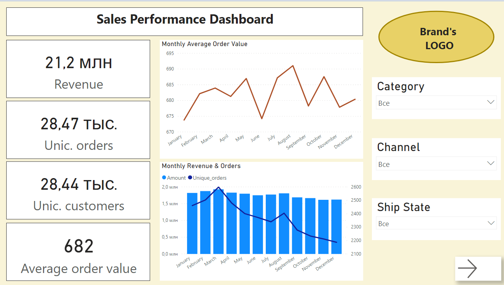
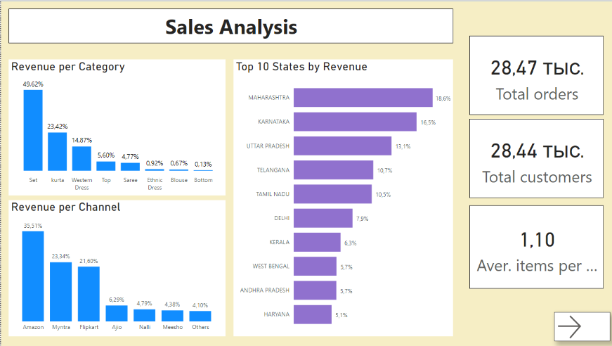
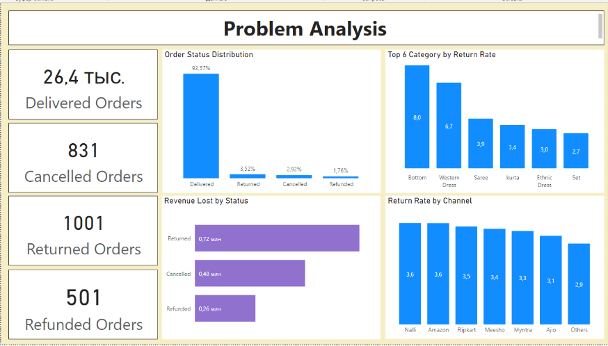
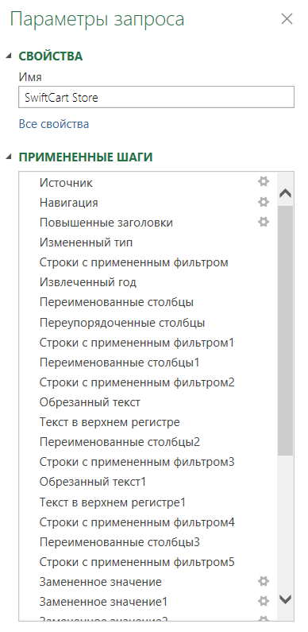

# SwiftCart Store — анализ продаж (+дашборд через Power BI)

В данном проекте были рассмотрены данные о продажах в индийском магазине одежды SwiftCart Store. Данные взяты из открытого датасета Kaggle, очищены и проанализированы с помощью Power Query в MS Excel. По результатам анализа построен трёхстраничный дашборд в Power BI с использованием DAX.

## Вопросы, на которые отвечает дашборд
- Как распределены продажи по месяцам и какой месяц был самым прибыльным по выручке?
- Какие категории товаров, каналы продаж и регионы являются наиболее выгодными для компании?
- Сколько проблемных заказов (возвраты, отмены, возврат денег) было за период и сколько выручки на этом потеряно?
- Какие категории товаров наиболее часто являются проблемными?

## Скриншоты дашборда

**Страница 1 — динамика продаж по месяцам**

**Страница 2 — анализ продаж по категориям и каналам**

**Страница 3 — анализ проблемных заказов**

## Ключевые выводы и рекомендации

### Динамика продаж
**Вывод:** Общая выручка — 21,2 млн при 28,47 тыс. заказов от 28,44 тыс. уникальных покупателей, средний чек — 682
Важно отметить, что количество заказов близко по значению к количеству уникальных пользователей. Следовательно, в среднем каждый человек делает примерно 1 заказ в сервисе, то есть доля повторных заказов - низкая.
Значение выручки, исходя из графика Monthly Revenue & Orders, распределено равномерно по всем месяцам и не падает ниже 1,5 млн. Но рассматривая детальней, нужно сказать, что пиковая выручка наблюдалась в марте. Так как точной информации нет, то предположу, что это может быть связано с распродажей или же с каким-либо праздником, который побудил людей пойти в магазин.
Среднее значение заказа держится довольно ровно, отклонения невелики, все значения лежат в пределах 675-690, что говорит о стабильных продажах в течении года.

**Рекомендация:** Так как средний чек стабилен в течении года, а на графике мы все же наблюдаем малое снижение выручки, после марта, стоит обратить внимание на то, что происходило в марте и возможно предложить решение, которое позволит во второй половине года, получить похожий по выручке месяц.

### Категория товаров
**Вывод:** Категория «Set» формирует 49,6% выручки, далее Kurta (23,4%) и Western Dress (14,9%) — на топ-3 категории приходится ~88% всей выручки. Остальные 5 категорий (Top, Saree, Ethnic Dress, Blouse, Bottom) в сумме дают около 12%.

**Рекомендация:** Сфокусировать основной бюджет на этих трёх категориях — именно они определяют результат продаж и выручки. По категориям с низкой долей (Blouse — 0,67%, Bottom — 0,13%) стоит отдельно решить: либо сократить ассортимент в пользу топ-категорий, либо оставить, но не инвестировать в их продвижение. При увеличении прибыли малых категорий в будущем, снова провести анализ и рассмотреть инвестирование в продвижение.

### Каналы продаж
**Вывод:** Amazon (35,5%), Myntra (23,3%) и Flipkart (21,6%) вместе дают более 80% выручки; остальное — на Ajio, Nalli, Meesho и прочих.

**Рекомендация:** высокая зависимость от трёх маркетплейсов — риск (например, при изменении комиссии площадки или блокировке аккаунта). Стоит рассмотреть точечные инвестиции в рост на Meesho/Ajio как страховку, не снижая приоритет топ-3 каналов.

### География
**Вывод:** Махараштра, Карнатака и Уттар-Прадеш — топ-3 штата, суммарно дающие около 48% выручки.

**Рекомендация:** Рекомендуется провести дополнительный анализ регионов с низкой выручкой для определения причин слабых продаж. Для топ штатов целесообразно рассмотреть возможность расширения логистических мощностей при подтверждении устойчивого спроса.

### Возвраты, отмены, возвраты денег
**Вывод:** 92,6% заказов доставляются успешно, но оставшиеся — это реальные потери: 0,72 млн из-за возвратов товара, 0,48 млн из-за отмен, 0,26 млн из-за возврата денег (в сумме ~1,46 млн, это ~6,9% от общей выручки). Самый высокий процент возвратов — у категорий «Bottom» (8,0%) и «Western Dress» (6,7%), заметно выше среднего по остальным категориям (2,7–3,9%). По каналам процент возвратов различается не сильно (2,9–3,6%), чуть выше у Nalli и Amazon.

**Рекомендация:** В первую очередь рассмотреть проблему возвратов категорий «Bottom» и «Western Dress», возможно проблема в качестве (например размера или качество тканей). Учитывая, что «Western Dress» ещё и в топ-3 по выручке, снижение её возвратов на несколько процентных пунктов даст ощутимый эффект на итоговую прибыль.

## Методология
**Исходные данные:** выгрузка заказов на уровне товарной позиции (одна строка = один SKU в заказе), 31 047 строк, 22 столбца (Order ID, Cust ID, Gender, Age, Month, Status, Channel, SKU, Category, Size, Qty, Amount, Ship City/State и др.).

**Этапы работы:** 
- Power Query — загрузка и очистка данных: проверка типов данных, пропусков, дубликатов, приведение текстовых полей (категория, канал, статус) к единому виду. Также замена в полях месяцев, для удобного понимания, а также добавления столбца с цифрами для дат, чтобы фильтрация прошла правильно.
- Power BI — визуализация: 3 страницы отчёта, карточки KPI, столбчатые и линейные графики, кросс-фильтрация между визуалами.
- DAX — расчёт мер в Power BI: Total Revenue, Unique Orders, Unique Customers, AOV, Return Rate, Revenue Lost by Status и т.д.

**Скриншот "примененные шаги" из Power Querry**

## Инструменты
- MS Excel
- Power Query — очистка и трансформация данных
- Power BI — дизайн отчёта и интерактивные визуалы 
- DAX — вычисляемые меры

## Источник данных
Датасет: Kaggle — SwiftCart Online Retail Sales Dataset
Ссылка: https://www.kaggle.com/datasets/zohairbaloch/swiftcart-online-retail-sales-dataset
Данные на уровне заказов интернет-магазина одежды в Индии за один календарный год.

## Repository Structure
PROJECT_1
│
├── README.md
├── swiftCart_dashboard.pbix
├── swiftCart_data.xlsx
└── images
    ├── 01_monthly_revenue_orders.png
    ├── 02_sales_analysis.png
    ├── 03_problem_analysis.png
    └── power_query_swiftcart.png
